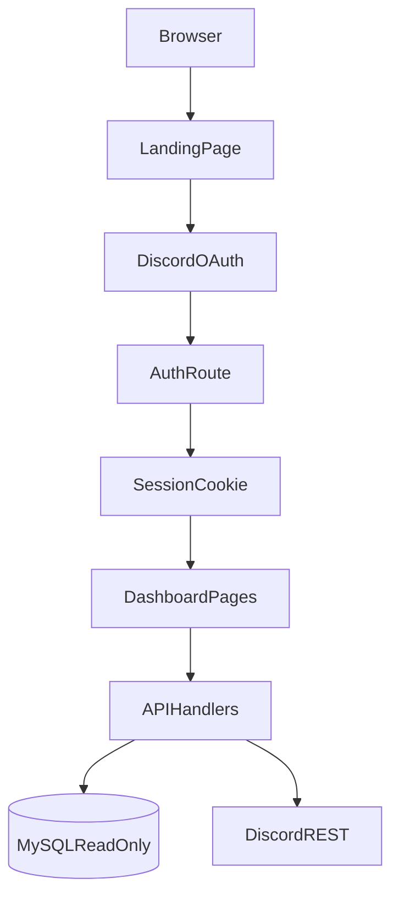
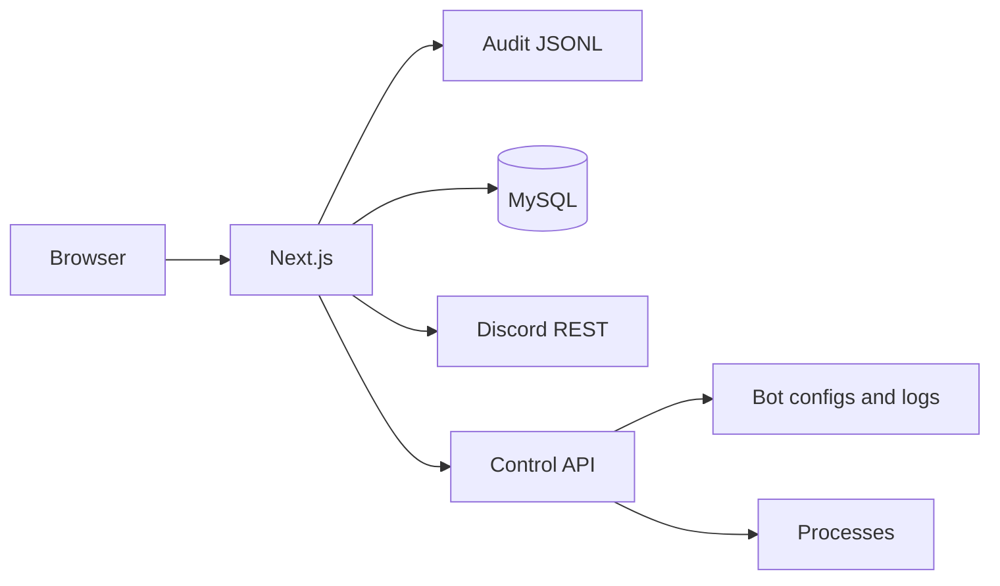

# Bots Dashboard Architecture

## Overview

Bots is a Next.js dashboard for Minecadia hosted at `https://bots.kartersanamo.com`.

Phase 1 (read) and Phase 2 (write) provide:
- Discord OAuth login with role-based access control.
- Owner override access.
- Bot registry and bot details for all six Minecadia bots.
- MySQL read/write (tier-gated) and Discord API read/write.
- Bot Control API for process, config, logs, and DMs.

## High-level flow

## Authentication

- Login starts at `/api/auth/login`.
- Callback is `/api/auth/callback`.
- Session data is saved in an HTTP-only cookie.
- Session includes Discord user identity, role IDs, and resolved permission tier.

Permission tiers:
- `owner`
- `manager`
- `admin`
- `moderator`
- `helper`
- `none`

Role mapping is based on Minecadia role hierarchy IDs.

## Data sources

### MySQL (read-only)
Used for dashboard metrics like:
- `tickets`
- `polls`
- `leveling`
- `blacklists`

### Discord API
Used for:
- Guild summary
- Role list
- Channel list

## Route structure

- `/` landing page
- `/login` auth entry
- `/unauthorized` no-access page
- `/dashboard` overview
- `/dashboard/bots` bots hub (fleet + grid)
- `/dashboard/bots/[botId]` tabbed bot workspace (`?tab=overview|console|config|inbox|actions|info`)
- `/dashboard/server` guild summary
- `/dashboard/docs` docs hub

## Bot Control API (Phase 2)

FastAPI on `127.0.0.1:8787`, authenticated via `X-Control-Key`. See [CONTROL_API.md](./CONTROL_API.md).

## Write flow

1. User action in dashboard UI
2. `POST/PATCH/DELETE` to `/api/*` with session cookie
3. `requireAction()` checks granular permission
4. `withAudit()` logs to `data/audit/audit.jsonl`
5. Mutation via Control API, MySQL write pool, or Discord actions

## Routes (Phase 2)

- `/dashboard/bots` — process control + bot management hub
- `/dashboard/bots/[id]?tab=` — console, config, inbox, actions, info
- `/dashboard/audit`
- `/dashboard/moderation`
