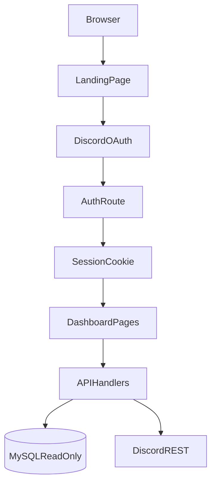

# Bots Dashboard Architecture

## Overview

Bots is a Next.js dashboard for Minecadia hosted at `https://bots.kartersanamo.com`.

Phase 1 is read-only and provides:
- Discord OAuth login with role-based access control.
- Owner override access.
- Bot registry and bot details for all six Minecadia bots.
- Read-only MySQL and Discord API data views.

## High-level flow

## Authentication

- Login starts at `/api/auth/login`.
- Callback is `/api/auth/callback`.
- Session data is saved in an HTTP-only cookie.
- Session includes Discord user identity, role IDs, and resolved permission tier.

Permission tiers:
- `owner`
- `manager`
- `admin`
- `moderator`
- `helper`
- `none`

Role mapping is based on Minecadia role hierarchy IDs.

## Data sources

### MySQL (read-only)
Used for dashboard metrics like:
- `tickets`
- `polls`
- `leveling`
- `blacklists`

### Discord API
Used for:
- Guild summary
- Role list
- Channel list

## Route structure

- `/` landing page
- `/login` auth entry
- `/unauthorized` no-access page
- `/dashboard` overview
- `/dashboard/bots` all bots
- `/dashboard/bots/[botId]` bot detail
- `/dashboard/server` guild summary
- `/dashboard/docs` docs hub

## Future architecture

Phase 2 introduces a separate Bot Control API service (FastAPI/Python) for:
- process control
- cog toggles
- config reloads
- log streaming

This keeps the web app and bot process management decoupled.
